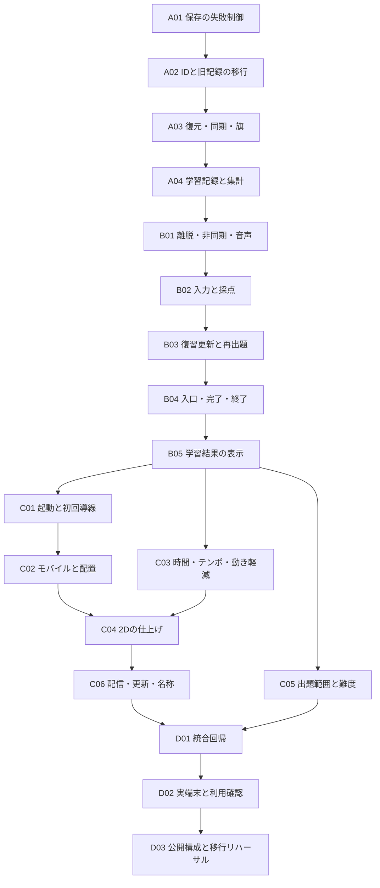

# 漢字ヨミタビ 公開版v1 実装修正計画

作成日：2026-09-06（JST）  
対象コード：HEAD `d58c4ce`  
計画の基準：[YOMITABI_QUALITY_AUDIT.md](YOMITABI_QUALITY_AUDIT.md)全文、および末尾の「公開版v1を作るために直すこと」10項目  
基準監査の内訳：**37件＝P0：2件、P1：18件、P2：15件、P3：2件**  
状態：**計画のみ。コード・データ・アセット・監査書は変更していない。**

## 実装の進め方

37件を個別に修正するのではなく、同じ保存契約・採点契約・画面ライフサイクルを共有する問題を、**18タスク／4フェーズ**へまとめる。優先度は監査書から変更しない。P0を最初に止め、P1をすべて公開条件にする。P2は監査書末尾の10項目の範囲で実装し、P3の全面改修は公開版v1へ持ち込まない。

| フェーズ | タスク | この段階で成立させること | 次へ進む条件 |
| --- | --- | --- | --- |
| PHASE A | A01〜A04 | 消えない保存、移行できるID、一致する復元状態、意味の定まった記録 | 保存・移行の障害注入と記録の整合検査に合格する |
| PHASE B | B01〜B05 | 1操作1処理、意図した採点・復習・遷移、正確な学習表示 | 各学習画面で同じ事例を通し、結果と保存が一致する |
| PHASE C | C01〜C06 | 起動、モバイル、時間・演出、見た目、難度、更新の品質 | 公開候補の機能と表示を確定し、既存セーブの継続を確認する |
| PHASE D | D01〜D03 | 統合回帰、実端末・子どもの利用、公開構成での更新検証 | 同一の公開候補で証拠が揃い、未解決のP0/P1がない |

自動テストはPHASE Dまで待たず、各修正と同じタスク内で追加・実行する。Dはそれらを公開候補で統合して通す段階。Aの合格は保存・記録の基盤の合格であり、Bで未修正の採点やCで未測定の遊びやすさまで保証するものではない。

### リスク分類と3D区分

| 分類 | 意味 |
| --- | --- |
| SAFE | 他の修正への影響が比較的小さい。主に確定済みデータの表示や装飾を扱う |
| CAREFUL | 状態、複数画面、入力、ライフサイクルなどへ影響する |
| HIGH RISK | 保存、移行、クラウド、既存ユーザーデータへ影響する |

リスク分類は実装時の慎重さを表し、監査のP0〜P3とは別。例えばP1の誤解を招く文言修正でも、保存を書き換えなければSAFEになり得る。

| 3D区分 | 今回の扱い |
| --- | --- |
| 継続利用 | 保存・ID・採点・復習・進行・入力の意味・状態管理。3D化後も必要で、今回正しくする |
| 混在 | 操作可能サイズ、時間管理、アクセシビリティ、読み順などの要件は残る。Canvas座標や描画への接続部分は差し替わり得る |
| 見た目限定 | 2Dの陰影、枠の質感、背景調整、スプライトの接地など。既存素材の編集に限定し、作り込みを広げない |

3Dのライブラリ選定、3Dモデル作成、シーン実装、全画面の描画基盤置換は行わない。今回直す箇所で、採点・保存をCanvas描画やアニメーション完了へ依存させない程度の責任分担を整える。

## 依存関係と変更の境界

図は推奨統合順。タスク欄の「依存するタスク」が直接の依存を示す。各フェーズの調査・テストデータ作成は先行してよいが、後段の修正を未合格の保存基盤で公開しない。A01〜A04は順次統合する。B完了後のC01・C03・C05は論理上分けられるが、`battleScreen.js`など同じファイルを触る変更は別々にレビューして順次取り込む。

### 横断して守るデータ契約

| 項目 | 計画上の方針・影響範囲 |
| --- | --- |
| 保存の成功 | ローカルへの確定保存と、クラウド同期済みを別の結果にする。ローカル成功だけでクラウド復旧を保証しない。時間待ちで成功を推定しない |
| 保存の順序 | 読込→検証→必要な移行→候補状態の生成→元データ保全→確定→メモリ反映を明示する。検証だけでStorageを書き換えない |
| 正規保存とミラー | `krb_save`を正規の保存スナップショットとし、`krb_review_queue`・図鑑キー等は互換ミラーとして扱う。ミラーから古い状態を無条件に混ぜ戻さない |
| 復元と同期の違い | 明示的なバックアップ復元は、空のキューや空の進捗も含む置換。通常の同期とは区別する。同期での図鑑の和集合を、バックアップ復元に流用しない |
| スロットと端末設定 | 現行の3スロット、スロット1のクラウドパス、スロット2以降の子パスを維持する。音量・入力方式など端末共有の設定と、子ごとの学習・表示設定を列挙し、保存・切替・取込の境界を合わせる |
| クラウドの競合 | 同じUID・スロット・基準リビジョンの継続更新だけを自動反映する。端末時刻だけの新旧判定やキューの無条件リモート優先をやめる。履歴の分岐を安全に統合できない場合は両方を保全し、自動上書きを止める |
| 旧コードとの同時利用 | 新版に追加した保護だけでは、開いたままの旧タブの書込を制御できない。旧コードが変更しない領域に移行原本と新版の確定コピーを保全し、旧世代の書込を検知したら保存・移行を止める。クラウドは書込側だけでなく受入側でも形式・基準版を検査する |
| 正解とヒント | ゲーム上の正解、支援なしの想起、一部ヒント、答え表示、旧記録の支援状況不明を区別する。既存の成功報酬を不用意に取り上げない |
| 復習と正誤記録 | 同じ解答結果から、正誤累計・ヒント区分・SRS・当該セッションの変化を一度だけ更新する。キュー更新だけ先に同期して、正誤記録が前のままになる経路を閉じる |
| 正規化と採点 | 文字入力の受付、かなの正規化、出題条件の決定、採点、記録、描画を分ける。名前入力は入力受付だけを共有し、かな限定の採点へ通さない |
| 既存の成果 | レベル・経験値・捕獲・クリア・既存の解放状態は保存する。過去の学習の意味が不明でも、一律リセットや称号剥奪で帳尻を合わせない |

これらは監査の完了条件を実現するための実装方針であり、現状で成立済みの仕様ではない。詳細な保存フィールド名はA01〜A04で確定する。セーブ形式、漢字カタログ、採点ルール、戦闘バランスは別の版として識別し、単一の「v1」だけで互換性を判定しない。大量の解答履歴を永続化する仕組みは今回の前提にしない。

### 既存データを変換するときの制約

- **重複した9組の漢字ID：** 対応表は旧カタログの版と実際の字を条件に作る。IDしかない混在記録は2字へ複製せず、どちらかへ推測配分しない。旧原文・曖昧な集計を保全し、現在の正規IDによる習得判定・SRSにはそのまま流さない。判別できる記録だけ移し、未判別分を消えたことにしない。
- **支援状況が不明な正解：** 旧正解数を自力正解へ変換しない。従来の取り組みの累計を保持し、新方式で観測した結果から支援区分を積む。過去のマスターによるゲーム上の解放・報酬と、新たな学習上の判定を分ける。
- **二重加算済みのクリア数：** 全履歴が誤って2倍だった証拠はない。単純に2で割らず、確定可能な履歴だけ補正する。確定不能な旧累計は由来を保持し、新しいクリアは1回ずつ加算する。クリア済みステージ集合を、周回込みの総クリア数の代用品にしない。
- **旗と難度：** 過去に保存されなかった旗は復元できない。新方式で保存した旗は維持する。難度調整でプレイヤーの育成値を再計算・初期化せず、敵の生成と表示の扱いを変える。旧版のベストタイムと新しい難度のタイムを同条件の記録として競わせない。
- **移行の再実行と停止：** 移行は二度実行しても増殖・再加算しない。原文退避の容量が足りなければ、元データを削除して空きを作らず、その移行を止める。未対応の新しい形式は読めない旨を返し、旧形式で上書きしない。

## PHASE A：検証を信頼できるデータ基盤にする

### A01：非破壊の保存・取込・スロット切替

- **対応する監査ID：** E01（P0）、E02（P0）、E03（P1）。監査末尾の項目1。
- **リスク分類：** HIGH RISK。
- **問題：** 退避失敗後の削除、破損原文の上書き、不正なJSON取込、保存完了前の成功表示がある。
- **修正対象ファイル：** `src/core/saveData.js`、`src/core/saveSlots.js`、`src/core/gameState.js`、`src/screens/settingsScreen.js`、`src/screens/titleScreen.js`。呼び出し監査の対象は自動保存・名前変更・勝利・経験値更新・バックアップ出力。必要なら検証／保存の小さな内部モジュールを追加するが、現時点では未作成。
- **依存するタスク：** なし。実装開始時に旧セーブ・破損セーブ・スロット集合の合成fixtureと最小のテスト実行口を用意する。
- **修正方針：** 読込と初期値の書込を分離し、missing／valid／corrupt／unsupportedを返す。保存APIはPromise等で確定・失敗を返す。取込は形式・版・必須型を検証してから反映する。スロット切替は元のキー集合と切替先を保全し、各書込・番号更新の成功を確認する。複数キーの書込を原子的と仮定せず、途中停止を識別できる最小の切替記録と再起動時の回復を設ける。成功表示・書き出しはローカル保存完了に接続する。
- **既存セーブへの影響：** 保存の境界を変更するため全利用者に影響する。旧形式は対応範囲を明示して読む。原文退避はスロット退避に巻き込まれて消えない場所に置く。バックアップは従来どおり対象の子を扱い、他の子や認証情報を混ぜない。
- **回帰リスク：** 非同期化による終了直前の取りこぼし、退避の容量増、途中切替後の異なる子の混在、明示的な初期化機能への影響。
- **必要な自動テスト：** 退避・本体書込・ミラー書込・スロット番号更新の各段階で例外／中断を注入する。`{}`・途中JSON・型違い・未知版で元文字列不変、遅い保存で成功表示が先行しないこと、1→2→1で全対象キーが一致することを検査する。
- **必要な手動テスト：** 合成セーブを使って通常保存、取込拒否、保存容量不足、画面再読込、3スロット切替、バックアップ出力を確認する。実際の子の原本を障害試験に使わない。
- **完了条件：** 監査E01の消失再現が失敗に転じ、どの失敗点でも元セーブが残るか回復可能。破損読込は原文を変えず、保存できた場合だけ成功と表示する。
- **3D区分：** 継続利用。保存APIに描画オブジェクトを入れない。

### A02：漢字ID・参照の修正と旧記録の移行

- **対応する監査ID：** E07（P1）。監査末尾の項目2。G05の前提。
- **リスク分類：** HIGH RISK。
- **問題：** 別字のID重複9組、不明な漢字参照延べ42件、敵参照1件があり、記録・復習・出題の同一性を信用できない。
- **修正対象ファイル：** `public/data/kanji_g1_proto.json`〜`kanji_g10_proto.json`、`public/data/stages_proto.json`、`public/data/stages.bonus.json`、該当する敵データ、`src/loaders/dataLoader.js`、`src/core/saveData.js`、`src/core/saveSlots.js`、`src/models/kanjiDex.js`、`src/models/reviewQueue.js`。移行対象には正誤統計・読み進捗・図鑑・復習・一時復習バッファ・クラウドの旧キャッシュを含める。
- **依存するタスク：** A01。
- **修正方針：** 先に全カタログの一意性・参照検査を追加する。字を削らず正規IDと版付き対応表を確定し、データと読込側の移行を同じ統合単位にする。曖昧な旧記録は前述の保全方針を適用する。不明参照は適当な既存字で穴埋めせず、ステージの意図と照合する。世界の問題プール切替はこの段階ではせず、C05で行う。
- **既存セーブへの影響：** 最も高い。非アクティブスロット、旧バックアップ、後日届く旧クラウドも同じ変換を通す。全スロットを一括上書きせず、スロット単位で検証・保全・確定する。曖昧な記録に由来する学習上の表示は不明のまま保全し、既存のゲーム進行は保持する。
- **回帰リスク：** 片側の字の消失、同じ実績の2字への複製、ID文字列の一括置換による誤移行、旧クラウドから重複IDが再侵入すること。
- **必要な自動テスト：** 全学年・通常／ボーナスの重複0／参照切れ0。9組ごとの旧IDのみ、文字付き、片側だけ判別可能、混在、未収集のfixture。移行2回、未使用スロット、旧バックアップ再取込、旧リモート再到着でも件数・総数が増えないこと。存在する敵が9体だけ残る欠損も検出する。
- **必要な手動テスト：** 9組それぞれを図鑑・問題・復習で別字として確認する。移行前後の保全記録と表示を照合する。構造修正に関わる読み・例文・敵の対応を校閲する。
- **完了条件：** カタログと参照が整合し、各字を独立して出題・記録できる。移行不能な情報が推測で上達実績にならず、旧原文が保持される。
- **3D区分：** 継続利用。漢字・敵・ステージのIDは画像名や将来のモデル名と分離する。

### A03：復元・クラウド同期・チェックポイントの一本化

- **対応する監査ID：** E04、E05、G03（いずれもP1）。監査末尾の項目1。
- **リスク分類：** HIGH RISK。
- **問題：** 初期保存がクラウド復旧を妨げ、復元後のメモリとStorageがずれ、空の復元が不完全。旗が保存されない。
- **修正対象ファイル：** `src/core/gameState.js`、`src/core/saveData.js`、`src/core/saveSlots.js`、`src/models/reviewQueue.js`、`src/models/kanjiDex.js`、`src/models/monsterDex.js`、`src/services/firebase/firebaseController.js`、`src/services/firebase/dataSync.js`、`src/main.js`、`src/screens/battleScreen.js`、`src/screens/settingsScreen.js`。
- **依存するタスク：** A01、A02。
- **修正方針：** 起動前の保存状態を保持し、復旧判定前のデフォルト確定を止める。読込・取込・スロット・クラウドに共通の検証済みスナップショット反映口を置き、空の配列／オブジェクトも置換する。旗5とクリア時の旗解除を保存する。同期はUID・スロット・世代を開始時に固定し、切替後の古い購読を解除する。基準リビジョンを用いて古い反映・競合上書きを防ぎ、競合原本は保全する。復元処理が自分の古いミラーを読み戻して再送しないようにする。
- **既存セーブへの影響：** 保存形式に旗・同期識別情報を追加する。古い旗なしセーブは従来位置から始め、存在しなかった旗を生成しない。旧クラウドに改版情報がなければ新しいローカルを無条件に負かさない。認証自体を失った端末を自動復旧できるとはしない。
- **回帰リスク：** 初回起動の永久待ち、別スロットへの遅延反映、空の明示復元を古い和集合で取り消すこと、同期の循環、異なる端末の進行分岐。
- **必要な自動テスト：** 同じUIDのローカル欠損／破損→クラウド復旧、空復元、旧リモート、オフライン中の更新→再接続、二端末の同じ基準版からの競合、同期中のスロット切替を試す。旗保存→再読込→6体目、クリア後→1体目、復元直後の復習メモリと次回保存の一致を検査する。
- **必要な手動テスト：** テスト用UIDと合成3スロットで、名前・図鑑・正誤・復習・旗・表示設定を照合する。通信が無い時も元記録が守られることを確認する。公開先の認証・ルール確認はD03で行う。
- **完了条件：** 反映直後、再保存後、再起動後の状態が一致する。古い同期と別スロットから上書きされず、旗から再開できる。復旧待ちと新規プレイの分岐が明示される。
- **3D区分：** 継続利用。保存対象は進行の意味であり、敵の見た目の途中状態ではない。

### A04：解答記録・ヒント区分・クリア集計の確定口

- **対応する監査ID：** T04、E10（P1）。T03の二重記録対策の基盤。監査末尾の項目2・4。
- **リスク分類：** HIGH RISK。
- **問題：** 正解・ヒント・読み進捗・日別集計の意味がずれ、勝利時は1クリアを2回加算する。過去の支援状況は復元できない。
- **修正対象ファイル：** `src/core/gameState.js`、`src/core/saveData.js`、`src/screens/battleScreen.js`、`src/screens/practiceBattleScreen.js`、`src/screens/quickReviewPracticeScreen.js`、`src/screens/reviewStage.js`、`src/screens/gradeQuizScreen.js`、`src/screens/resultWinScreen.js`。保存形式の追加項目をA03の復元・同期にも通す。
- **依存するタスク：** A01、A02、A03。
- **修正方針：** 確定結果に問題識別子・漢字ID・回答した読み・解答元・ヒント／答え提示の状況を渡し、累計・日別・読み進捗を一度更新する。支援状況不明を自力扱いする既定値を作らない。「おしい」の案内で答えを見せた場合も答え提示として扱う。同一問題の重複と、正規の再出題への新しい解答を区別する。クリア加算・保存の責任を1か所にする。SRS更新規則そのものはB03で接続する。
- **既存セーブへの影響：** 旧累計を保持し、新方式の支援区分を追記する。従来のマスター実績はゲーム上の獲得済み成果として保ち、自力習得と同一視しない。過大かもしれない旧クリア数を一律半減しない。変更後に実測した集計の起点・版を識別できるようにする。
- **回帰リスク：** 複数画面での加算漏れ、通常戦闘と練習で違うヒント分類、旧達成の剥奪、再挑戦まで重複排除すること、ゲーム報酬と教材評価の混同。
- **必要な自動テスト：** 自力／ヒント1〜3／答え表示／支援不明、攻撃／回復／練習／専用復習／クイズ、同一確定の重複を表形式で検査する。1回のクリアは＋1、再描画は＋0、正式な周回は＋1。保存・復元後も旧値と追加値の意味が保たれることを確認する。
- **必要な手動テスト：** ヒントで成功してもゲーム上の達成感が残ること、旧セーブのレベル・捕獲・解放が維持されることを確認する。表示の最終表現はB05で整える。
- **完了条件：** 新たな記録が実際の入力・支援状況と一致し、二重加算されない。過去の不明情報を自力正解や確定した改善へ作り替えない。Aの保存回帰も再度合格する。
- **3D区分：** 継続利用。アニメーションを再生する前に結果を確定し、描画の再実行で記録しない。

## PHASE B：ゲームと教材として正しく動かす

### B01：画面離脱・遅延処理・音声切替の所有者を揃える

- **対応する監査ID：** E08、U06（P1）、E12（P2）。E16は触る範囲のイベント契約だけ参照。監査末尾の項目7。
- **リスク分類：** CAREFUL。
- **問題：** 旧画面のタイマーや非同期読込が次画面のHP・問題・BGMを変え、同じ戻るボタン内でも遷移先が異なる。
- **修正対象ファイル：** `src/core/fsm.js`、`src/core/eventBus.js`、`src/init/fsmsetup.js`、`src/states/battleStateFactory.js`、`src/screens/battleScreen.js`、`src/screens/reviewStage.js`、`src/screens/stageLoadingScreen.js`、`src/screens/gameOverScreen.js`、`src/screens/battle/theme.js`、`src/audio/audioManager.js`。他の変更対象画面のexitも確認する。
- **依存するタスク：** A03、A04。
- **修正方針：** 実際に呼ばれるexitでタイマー・入力購読を解除する。画面／戦闘の世代を確認し、古いPromise結果を破棄する。可能な取得は中止し、中止不能なものも反映を防ぐ。見せる戻る矩形を判定にも使う。音の停止は開始時の音声要素を対象にする。遷移payloadは既存の有効な渡し方へ揃え、全イベント基盤を置き換えない。離脱しても確定済みの保存処理は完了させ、その結果を別スロットへ転用しない。
- **既存セーブへの影響：** スキーマ変更なし。古い画面による意図しない記録・HP変化を止める。確定済み解答を離脱と同時に捨てない。
- **回帰リスク：** 正常な勝利・捕獲遷移まで止めること、入力イベントの解除漏れ／二重登録、必要なBGMの停止、遅い保存のキャンセル。
- **必要な自動テスト：** 正誤直後・撃破直後・ロード中に退出し、偽時計と遅延Promiseを完了させても旧状態が反映されないこと。退出→即再入場、戻る中心と端の同一遷移、gameover停止中のbattle再生継続を検査する。
- **必要な手動テスト：** 戻る・練習へ・リトライを短い間隔で繰り返し、HP・現在問題・入力欄・曲を確認する。読み上げが次問や次画面と競合しないか試聴する。
- **完了条件：** 旧画面の予約が新画面へ一切反映されず、意図した遷移が1回だけ起きる。監査のBGM競合再現も解消する。
- **3D区分：** 継続利用。画面世代・中止・音声の所有権は3Dのシーン切替にも必要。

### B02：入力受付と採点の共通化

- **対応する監査ID：** E09、T03（P1）、T04の支援区分。監査末尾の項目3・4・6。
- **リスク分類：** CAREFUL。
- **問題：** 変換確定が送信になり、復習だけ空欄・連続Enter・近い入力への扱いが異なる。
- **修正対象ファイル：** `src/utils/readings.js`、`src/core/readingScope.js`、`src/core/exampleMode.js`、`src/ui/kanaPad.js`、`src/screens/playerNameInputScreen.js`、`src/screens/battleScreen.js`、`src/screens/practiceBattleScreen.js`、`src/screens/quickReviewPracticeScreen.js`、`src/screens/reviewStage.js`、`src/screens/gradeQuizScreen.js`。共通の入力受付処理は小さな内部モジュールとして追加可。
- **依存するタスク：** A04、B01。
- **修正方針：** composition・空欄・送信済みロックを共通化する。50音パッドと端末キーボードは同じ送信口へ入れ、疑似Enterとクリックの二重処理を避ける。名前は自由な名前入力として扱い、かな正規化を強制しない。学習画面は共通正規化／近似判定を使い、単字・音訓限定・例文の出題条件は別入力として渡す。近い入力は穏やかに再入力を促し、まだ正誤を確定しない。画面固有の攻撃・回復効果は採点関数へ混ぜない。
- **既存セーブへの影響：** 設定の既定値を変えず、今後の不要な誤答記録を止める。既存の誤答を推測で削除しない。B02の確定結果をA04へ渡す。
- **回帰リスク：** 正当な読みを正規化しすぎること、名前が変換されること、IME確定後の正規の送信まで無視すること、パッドとキーボードで異なるコマンドが動くこと。
- **必要な自動テスト：** 同一の読みfixtureを各学習画面のアダプターへ渡す。カナ／空白／濁点／小書き／音訓違い／例文、空欄、compositionイベント順、連続3回送信、回答中のコマンド切替を検査する。名前の漢字・カナを勝手に変換しないことも確認する。
- **必要な手動テスト：** Windows日本語IME、iPad／iPhone／Androidの端末キーボードと50音パッドで変換→確定を行う。自動イベント試験だけで実IME合格とはしない。C02で配置変更後に再確認する。
- **完了条件：** 変換確定では送信せず、回答決定で1件だけ記録する。画面間の判定差が出題条件によって説明でき、連打で問題を飛ばさない。
- **3D区分：** 継続利用。入力の意味と採点は残す。DOMイベント接続は将来の表示方式に合わせて差し替え可能にする。

### B03：解答結果と復習予定を同時に更新する

- **対応する監査ID：** T02、T03、T04（P1）。E05のメモリ整合を利用。監査末尾の項目3・4。
- **リスク分類：** CAREFUL。
- **問題：** 再誤答で予定が変わらず、敵の弱点による一時的な候補外で再出題予約を失う。支援使用時のSRS品質が画面によって違う。
- **修正対象ファイル：** `src/models/reviewQueue.js`、`src/core/gameState.js`、`src/main.js`、`src/screens/battleScreen.js`、`src/screens/practiceBattleScreen.js`、`src/screens/quickReviewPracticeScreen.js`、`src/screens/reviewStage.js`、`src/screens/gradeQuizScreen.js`。
- **依存するタスク：** A02、A03、A04、B02。
- **修正方針：** B02の確定結果からA04の記録とキュー更新を同じ候補状態へ反映し、A01で保存する。初回予定は既存の次の午前4時を維持する。既存項目への再誤答・答え表示は予定を遅らせず、既存の翌日再接触方針へ戻す。支援なし／ヒント1〜3の品質規則を通常戦闘へ合わせ、各画面に独立実装しない。戦闘内の予約は一時候補外なら保持し、ステージ外かどうかは全体プールで判断する。間隔学習を別方式へ置換しない。
- **既存セーブへの影響：** 今後の解答で対象項目の予定・間隔が変わる。無関係な全項目を一斉に期限到来へしない。旧予定はA02で解決可能なIDに限って維持する。既存キューがない初回の自力正解を、理由なく全件復習待ちにしない。
- **回帰リスク：** 同じ字の過剰反復、キューと累計の片側だけ保存、時計境界の誤り、通常画面と復習画面で同一解答を二度処理すること。
- **必要な自動テスト：** 6日先→再誤答で予定が早まる、答え表示で間隔が伸びない、午前4時前後、期限到来済み、重複送信、弱点切替、直近5問除外、途中終了、保存失敗→再試行を検査する。キューと正誤のスナップショットが同じ解答まで進んでいることを確認する。
- **必要な手動テスト：** 間違える→数問後に再会する→翌日の復習→正解／再誤答を通す。復元直後やスロット切替後でも同じ結果になることを確認する。
- **完了条件：** 監査の再誤答無更新と予約消失を解消し、1解答分だけ予定・記録が進む。翌日以降の予定と案内が一致するための値をB04へ渡せる。
- **3D区分：** 継続利用。復習の時計・抽選・記録は敵モデルや表示速度に依存させない。

### B04：復習の入口と練習の終わり方を揃える

- **対応する監査ID：** G04（P1）、G08（P2）。監査末尾の項目3・7。
- **リスク分類：** CAREFUL。
- **問題：** 復習ゼロで未解放ボーナスへ進む。通常練習が完了しても自動で次の課題を出し、専用復習と終了方法が異なる。
- **修正対象ファイル：** `src/screens/stageSelectScreen.js`、`src/screens/worldStageSelectScreen.js`、`src/screens/reviewStage.js`、`src/screens/practiceBattleScreen.js`、`src/screens/quickReviewPracticeScreen.js`、`src/screens/gradeQuizScreen.js`、`src/screens/resultWinScreen.js`、`src/core/bonusManager.js`。必要な画面遷移接続のみ`src/init/fsmsetup.js`。
- **依存するタスク：** A03、B01、B03。
- **修正方針：** 今日の対象ゼロは既存の空状態へ進む。すべての入口で同じボーナス解放判定を使う。完了時は採点済みの状態で止め、既存の戻る・続ける操作を明確にする。終了を「キャンセルした失敗」のように表現しない。予定が翌朝ならその予定に沿う文言を使い、新しい課題やモードを増やさない。
- **既存セーブへの影響：** 解放済みフラグや完了記録は保持する。入口を統一する際に過去の解放を再ロックしない。根拠のない未解放経路だけを閉じる。
- **回帰リスク：** 復習の空画面往復、終了直後の旧タイマーで自動開始、世界側から日本側へ戻ること、練習完了の未保存。
- **必要な自動テスト：** 初期／翌朝待ち／対象あり／全件終了の4状態、通常練習と専用復習の完了→停止、続行→1問、終了→地図、未解放ボーナス全入口、既解放の保持を検査する。
- **必要な手動テスト：** 日本・世界それぞれで復習開始と終了を行う。「今日はここまで」がどこへ戻るか分かり、自分で終えられるか確認する。配置の最終確認はC02・D02。
- **完了条件：** 表示した行き先と遷移が一致し、終了後に意思確認なく次の課題を始めない。G04のボーナス迂回がなく、正規の解放済み進捗は維持される。
- **3D区分：** 継続利用。進行・解放・終了の意味は残る。ボタンの描き方は共通化の必須範囲ではない。

### B05：学習結果・上達・収集の表示を事実に合わせる

- **対応する監査ID：** T04、T05（P1）、T01、G07、G08、U08（P2）。監査末尾の項目4・7。
- **リスク分類：** SAFE。A04で確定したデータの読取・表示に限定する。
- **問題：** 10問の成果を学年全体の習得として称賛し、上達の具体例が薄く、収集バーは常に満タン。過去の回数を埋めるよう促す表示もある。
- **修正対象ファイル：** `src/screens/resultWinScreen.js`、`src/screens/gradeQuizScreen.js`、`src/screens/profileScreen.js`、`src/models/profile.js`、`src/core/reviewExport.js`、`src/screens/Dex/kanjiDexScreen.js`、`src/screens/reviewStage.js`、`src/screens/courseSelectScreen.js`、`src/screens/regionSelectScreen.js`、`src/screens/worldStageSelectScreen.js`、`README.md`。関連する学習説明の文字列を確認する。
- **依存するタスク：** A04、B02、B03、B04。
- **修正方針：** 「今回の問題」「正解入力回数」「支援の有無」のように実績範囲を伝える。既存結果欄に今回答えられた漢字・読みを少数示し、比較できない過去から改善を捏造しない。収集は対象範囲の分母を定義するか、最小案として収集数だけを表示する。週次は今回取り組んだ事実を返す。世界の難度と例文対応範囲を説明し、全学年の例文追加はしない。
- **既存セーブへの影響：** 読取のみ。旧値は旧値として表示し、自力正解・新しいマスターへ書き換えない。過去のゲーム実績は保持する。
- **回帰リスク：** 文字列と実際の集計条件の不一致、CSVの列の意味が変わること、少画面で増やした具体例が読めないこと。
- **必要な自動テスト：** 表示値の選択に限り、旧／新記録、ヒントあり、10問中8問、初正解ゼロ、収集0／1／途中、週次増減を検査する。CSVのヘッダーと値の意味も照合する。配色や定型文の変更だけを固定するテストは作らない。
- **必要な手動テスト：** 結果・図鑑・プロフィール・CSVで同じ実績を照合する。本人が今回読めた字を挙げられるか、少ない回数の日に不足を求められたと感じないかをD02で確認する。
- **完了条件：** 学習効果を過大に断定せず、収集1件で全体100%にならない。今回の具体例と継続の価値が既存画面から分かる。
- **3D区分：** 継続利用。文言とデータの意味は残り、具体的なパネル配置はC02・C04で調整する。

## PHASE C：公開品質を高める

### C01：ローカル起動を成立させ、最初の一問までを軽くする

- **対応する監査ID：** E06、E11（P1）、G01（P2）。監査末尾の項目5。
- **リスク分類：** CAREFUL。
- **問題：** 外部SDK・認証の失敗で起動が止まり、約24.26MiBの共通画像の直列取得とデータの二重読込が最初の操作を遅らせる。
- **修正対象ファイル：** `index.html`、`src/main.js`、`src/init/fsmsetup.js`、`src/loaders/assetsLoader.js`、`src/loaders/dataLoader.js`、`src/ui/bootProgress.js`、`src/services/firebase/firebaseController.js`、`src/screens/titleScreen.js`、`src/screens/playerNameInputScreen.js`、`src/screens/courseSelectScreen.js`、`src/screens/regionSelectScreen.js`、`src/screens/stageLoadingScreen.js`、`src/tutorial/tutorialData.js`。軽量化対象は既存の起動UI画像に限定する。
- **依存するタスク：** A03、B01、B04。PHASE Bの合格後に統合する。
- **修正方針：** 描画とローカルで可能な開始を、認証成功から切り離す。A03の復旧必要フラグを維持し、遅れて到着したクラウドが開始済みのプレイを上書きしない。必須取得の失敗は再試行／戻るを返す。開始に必要な画像だけを適切な同時数で取得し、JSON取得と構築は共有する。初回の選択・出発と案内を明確にする。存在しない素材は参照と代替を整理する。
- **既存セーブへの影響：** スキーマ変更なし。名前確定の通信順序変更で既存の子を新規作成しない。ローカル保存とクラウド同期の状態は区別する。
- **回帰リスク：** 未読込データの先行利用、初期値による復旧の妨害、取得の並列化による通信負荷増、別地域への初回移動での欠損。
- **必要な自動テスト：** SDK・認証・画像・JSON失敗、遅い復旧、二重初期化、同じリソースの重複取得抑止、必須データなしで戦闘へ入らないことを検査する。
- **必要な手動テスト：** 冷たいキャッシュ・制限回線で、最初の描画、操作可能、最初の問題までの時刻と転送量を記録する。初回の30秒を観察し、名前確定・選択・出発の迷いを確認する。
- **完了条件：** 認証失敗でもローカルで可能な操作が成立し、必須データ失敗で永久待機しない。未使用地域を待たず、監査値から起動前転送量が減った証拠がある。秒数目標は初回計測を踏まえD02前に固定する。
- **3D区分：** 混在。起動状態・取得共有・失敗制御は残る。読み込む2D素材と容量配分は将来見直す。

### C02：モバイルの表示寸法・入力欄・当たり判定を揃える

- **対応する監査ID：** U01、E09（P1）、U04（P2）。監査末尾の項目6。
- **リスク分類：** CAREFUL。
- **問題：** 固定Canvasの縮小で文字・ボタンが小さく、パッド用寸法指定とCSSが競合する。案内と操作位置も一致していない。
- **修正対象ファイル：** `style.css`、`index.html`、`src/main.js`、`src/ui/kanaPad.js`、`src/ui/uiRenderer.js`、`src/ui/textScale.js`、`src/ui/ruby.js`、`src/screens/battle/theme.js`、`src/screens/battleScreen.js`、`src/screens/playerNameInputScreen.js`、`src/screens/practiceBattleScreen.js`、`src/screens/quickReviewPracticeScreen.js`、`src/screens/reviewStage.js`、`src/screens/gradeQuizScreen.js`、`src/tutorial/tutorialData.js`、`src/ui/tutorialUI.js`。選択・結果画面にも同じ寸法規則を適用する。
- **依存するタスク：** B02、B04、B05、C01。
- **修正方針：** 表示領域の決定、Canvasへの座標変換、DOM入力欄・パッドの配置を一つの寸法計算へ合わせる。主要操作は実表示44px程度以上を監査どおり設計目標にし、文字拡大・ルビ・キーボード表示時も成立させる。全面DOM化は前提にせず、必要なレイアウトを既存UIで修正する。倍率・DPRの扱いと、描画／当たり判定の矩形を一致させる。
- **既存セーブへの影響：** フォント拡大等の設定は維持する。端末共有設定を子別設定へ無断で移動しない。配置変更で入力や保存形式を変えない。
- **回帰リスク：** 座標の二重拡大、縦横回転後のずれ、iOSの表示領域変動、画面間で共用入力欄のスタイルが残ること、ルビの重なり。
- **必要な自動テスト：** 寸法・座標変換に意味のある境界値テストを置く。代表幅、DPR、ボタン中心・端、入力欄と決定の可視範囲を検査する。B02の送信試験を実レイアウト経路でも通す。
- **必要な手動テスト：** 幅390pxの縦持ち、対象iPad／iPhone／Androidで、回転、ソフトキーボード、50音パッド、文字拡大、ルビを組み合わせる。名前から結果・復習までタップして通す。
- **完了条件：** 問題・入力・決定・戻るが同時に使え、主要操作が押せる実寸になる。表示位置と判定が一致し、拡大設定でも重ならない。
- **3D区分：** 混在。読みやすさ、操作寸法、入力の可視性は必須。Canvasの具体座標は差し替わり得る。

### C03：演出時間・テンポ・動き軽減を揃える

- **対応する監査ID：** U05（P1）、G02、E13（P2）。U02の速い上下移動も扱う。監査末尾の項目8。
- **リスク分類：** CAREFUL。
- **問題：** フレーム依存で端末ごとに時間が変わり、離席時間が加算される。待ちは長いのに誤答を読む時間は短く、Canvasに動き軽減が効かない。
- **修正対象ファイル：** `src/main.js`、`src/screens/battleScreen.js`、`src/screens/battle/theme.js`、`src/screens/titleScreen.js`、`src/screens/reviewStage.js`、`src/screens/gradeQuizScreen.js`、`src/screens/practiceBattleScreen.js`、`src/audio/audioManager.js`、`src/core/sessionTimer.js`、`style.css`。
- **依存するタスク：** A04、B01、B02、B03、B04。PHASE Bの合格後に統合する。
- **修正方針：** 演出は経過時間で扱い、非表示復帰時の大きな差分を処理する。学習の予定日時、実プレイ時間、設定した区切り時間を別の意味として保つ。正解直後の反応を残し、重複した操作待ちを減らす。誤答は既存の決定操作等で確認できる時間を確保する。動き軽減時は揺れ・全画面点滅・常時移動を止め、正誤の文字は残す。
- **既存セーブへの影響：** 今後のプレイ時間の計測が変わる。過去の離席分を推測して差し引かない。復習予定は実時刻のままで、演出の一時停止に合わせて延期しない。
- **回帰リスク：** タイマー停止で戦闘進行まで止まること、演出短縮で二重入力可能になること、答え確認中に敵が動くこと、復帰時の一括ダメージ、音声フェードの競合再発。
- **必要な自動テスト：** 30／60／120fps相当、非表示→復帰、動き軽減、正誤→確認→次問の順序を偽時計で検査する。採点・ダメージ・保存がフレーム回数や描画終了に依存しないことを確認する。
- **必要な手動テスト：** 誤答の読みを確認できるか、正解の反応が遅く感じないか、音と次問が重ならないかを試す。OSの動き軽減とアプリの各画面を確認し、バックグラウンド復帰も試す。
- **完了条件：** 端末のFPSで処理結果・演出秒数が変わらず、離席時間が丸ごとプレイ時間へ入らない。動き軽減がCanvasにも反映され、読む時間が確保される。
- **3D区分：** 混在。時間・一時停止・動き軽減の契約は残る。個々の2Dエフェクトの描画は見直し可能。

### C04：既存2D画面の最小限の仕上げ

- **対応する監査ID：** U02、U03（P2）。監査末尾の項目8。U07の全素材磨き込みは含めない。
- **リスク分類：** SAFE。配置の意味・当たり判定・状態更新は変更しない。
- **問題：** ロゴの弱さと、背景・枠・ボタン・モンスターの密度や余白の差が製品の統一感を下げる。
- **修正対象ファイル：** `src/screens/titleScreen.js`、`src/screens/playerNameInputScreen.js`、`src/screens/stageLoadingScreen.js`、`src/screens/battleScreen.js`、`src/screens/resultWinScreen.js`、選択画面群、`src/screens/battle/theme.js`、`src/ui/uiRenderer.js`、`src/ui/palette.js`、`style.css`。必要な場合だけ既存のロゴ・パネル・背景画像を調整する。
- **依存するタスク：** C02、C03。
- **修正方針：** 代表画面の背景の明るさ、文字色、枠、主／補助ボタン、モンスターの余白・接地を少数の規則で揃える。ロゴを読める大きさへ整える。全素材の描き直し、新規エフェクト大量追加、3D化前提のアセット制作はしない。
- **既存セーブへの影響：** なし。素材ID、収集ID、セーブ形式を変えない。ファイルの版管理はC06で扱う。
- **回帰リスク：** 問題の漢字のコントラスト低下、透明余白による実質縮小、装飾でボタンの押せる範囲が誤解されること。
- **必要な自動テスト：** 装飾専用の単体テストは不要。変更した素材の参照切れを既存の資源検査で確認し、C02の操作寸法試験を通す。
- **必要な手動テスト：** タイトル→名前→地図→準備→戦闘→結果を並べて確認する。代表背景・通常敵・細密な敵で問題が読みやすいかを比較する。
- **完了条件：** 同じ製品の画面として見え、漢字と次の操作を装飾が邪魔しない。変更は既存素材の表示品質に収まる。
- **3D区分：** 見た目限定。将来の作り直しが多い領域なので、v1に必要な統一までで止める。

### C05：既存の出題範囲と難易度係数を整える

- **対応する監査ID：** G05、G06（P2）。監査末尾の項目9。
- **リスク分類：** CAREFUL。既存の育成・解放を一括書換えする実装へ広げる場合はHIGH RISKとして再分割が必要。
- **問題：** 世界でステージ別プールが使われず、自分の学年から始めた初期プレイヤーにも後半の敵係数が乗る。弱点以外の正解でボスが長引く。
- **修正対象ファイル：** `src/loaders/dataLoader.js`、`public/data/stages_proto.json`、`public/data/stages.bonus.json`、`src/screens/battleScreen.js`、`src/core/bonusManager.js`、`src/screens/practiceBattleScreen.js`、`src/screens/resultWinScreen.js`、必要な版情報のみ`src/core/saveData.js`・`src/core/gameState.js`。
- **依存するタスク：** A02、A04、B02、B03、B04。PHASE Bの合格後に統合する。
- **修正方針：** 修正済みカタログからステージ定義と実抽選集合を一致させる。小1・小3・小6からの初回と、育成済み再訪を別々に計測して既存HP・攻撃力係数を調整する。ボスの音訓・シールドの案内と、正解が大量に必要になる負担を合わせて見直す。新しいモードを増やさず、係数の値は計測を根拠に確定する。プール変更で既存解放を取り消さない。
- **既存セーブへの影響：** レベル・経験値・攻撃力・HP上限・捕獲・クリアを保持する。新しい敵生成は新しい戦闘開始または旗からの再開時に適用し、戦闘中に係数を差し替えない。旧ベストタイムは保全して版を区別し、異なる難度の記録を単純比較しない。保存済みの復習字が今のステージ外でも、全体の復習から削除しない。
- **回帰リスク：** ステージを変えたら解放率が下がること、ボーナスの出題条件変化、敵が簡単になりすぎること、旗位置と敵リストの不一致、旧記録が不利になること。
- **必要な自動テスト：** 全ステージの期待ID集合、候補不足、再出題保持、固定乱数での敵能力・弱点・シールド計算、新規Lv1と育成済みfixture、旧旗・解放・ベストタイム保持を検査する。表の計算だけで実クリア時間を保証しない。
- **必要な手動テスト：** 小1・小3・小6と世界の代表で、通常敵・ボスまでの正誤数、ヒント、回復、中断、所要時間を記録する。正解しているのに進まない理由が分かるか、前学年のレベル上げが実質必須になっていないか確認する。
- **完了条件：** ステージの意図と抽選が一致し、学年直行で過度に長引く状態が改善した比較結果がある。既存セーブの育成・収集・解放を失わず、難度の異なる記録の意味も区別される。
- **3D区分：** 継続利用。敵能力・抽選・難度の版は描画とは独立して残す。

### C06：オンラインWeb版の配信・キャッシュ・名称を揃える

- **対応する監査ID：** E14、E15（P2）。監査末尾の項目10。
- **リスク分類：** CAREFUL。
- **問題：** 毎回変わる素材URLと固定名の長期immutableが混在し、旧SW退役の対象が広い。名称・配布説明も現状と違う。
- **修正対象ファイル：** `src/loaders/assetsLoader.js`、`manifest.json`、`index.html`、`public/sw.js`、`vercel.json`、`firebase.json`、`vite.config.js`、`README.md`。配布対象の既存素材と参照一覧を確認する。
- **依存するタスク：** A01、A02、A03、C01、C04。
- **修正方針：** 実際の公開先を確認し、版が同じなら再利用、版が違えば更新されるURL／ヘッダーへ揃える。`Date.now()`での恒常的な無効化をやめる。旧SWの登録・キャッシュは本作の対象に限定して退役させる。HTML・JS・カタログ・画像が混在版にならない更新手順を作る。既に開いている旧タブはキャッシュ更新だけで消えないため、A01・A03の世代別保全と異世代書込の停止を接続する。名称とオンラインWeb版の説明を統一する。未参照素材を配布から外す際は、動的パスも確認する。
- **既存セーブへの影響：** セーブや認証Storageは削除しない。A01の未知版保護が効くのはその保護を持つコードであるため、旧コードが`krb_save`へ書いた場合も新版の確定コピーを失わず、旧値を正史へ採用しないことを検証する。旧タブの閉鎖・再読込が必要な状態では、記録を保全してその旨を案内する。別アプリのキャッシュを掃除しない。
- **回帰リスク：** 固定名の更新が届かない、参照確認不足で後半地域の素材が欠ける、古いSWの再登録、旧タブからの旧形式書込、配信先ごとのヘッダー差。
- **必要な自動テスト：** 配布物の参照・版整合、SW退役の対象範囲、同一版と次版の取得先、未知セーブ版の上書き拒否を検査する。実配信ヘッダーはD03で確認する。
- **必要な手動テスト：** 旧版を開いたテスト端末で更新、通常起動とホーム画面起動、地域移動、画像差し替えを確認する。オフライン時の案内が実際の対応範囲と一致するか確認する。
- **完了条件：** 対応公開先で同一版は再利用され、次版は届く。旧SWのある端末でも保存・認証が残り、本作以外のキャッシュを変更しない。PWA再実装はしない。
- **3D区分：** 混在。更新・版整合の原則は残る。将来の3D素材の形式と容量配分は別途設計する。

## PHASE D：公開前の証拠を揃える

### D01：公開候補の統合回帰を固定する

- **対応する監査ID：** 実装対象のP0・P1・P2全35件。E16の指摘する検査不足に対し、今回の修正を守る範囲だけ対応する。監査末尾の項目1〜10。
- **リスク分類：** CAREFUL。
- **問題：** 単体では合格しても、保存・復習・入力・遷移・更新の組合せで不整合が再発し得る。
- **修正対象ファイル：** `package.json`のテスト実行定義、`scripts/verify_stage_id_integrity.mjs`、追加する回帰テスト／合成fixture（パスは実装時確定）、`docs/smoke-test-checklist.md`、検証記録。アプリコードの追加変更が必要なら原因タスクへ戻す。
- **依存するタスク：** A01〜A04、B01〜B05、C01〜C06。
- **修正方針：** 各タスクで追加したテストを一つの実行口へまとめ、公開候補のコミットと配布物を固定する。Node標準テスト等で保存・採点の意味を検査し、必要なブラウザー統合試験を補う。見た目の全ピクセル固定や全面lint導入を公開条件にしない。
- **既存セーブへの影響：** 合成fixtureだけを使用する。実ユーザーのローカル／クラウドをテストで消去しない。
- **回帰リスク：** テスト用Storageが本番と共有されること、内部関数の模倣だけを試して本体の接続を見逃すこと、単体テストと公開ビルドの版違い。
- **必要な自動テスト：** 下記の共通回帰セットR01〜R08、本番ビルド、ID一意性・参照整合、実際の画面アダプターを通る解答→保存→再起動を実行する。既存のstage ID検査だけで合格にしない。
- **必要な手動テスト：** 自動試験の結果と監査の各完了条件を照合し、実機待ち項目を明示する。故障注入が本当に実行され、既知の旧実装で失敗する試験になっているかレビューする。
- **完了条件：** 1つの公開候補について再現可能な実行手順と全結果が残り、自動化対象が合格。未実施の実機項目を合格扱いしていない。
- **3D区分：** 継続利用。意味・保存・遷移の回帰は残る。将来、描画部分の試験だけ更新する。

### D02：実端末・教材内容・子どもの利用を確認する

- **対応する監査ID：** E07、E09、U01、U05のP1、G01・G02・G05〜G08、T01・T05、U02〜U04・U08、E12・E13などの実測／評価部分。監査末尾の項目2・4〜10。
- **リスク分類：** CAREFUL。
- **問題：** 監査は実機の操作・音の試聴・子どもの理解・全件校閲を完了していない。
- **修正対象ファイル：** `docs/smoke-test-checklist.md`、追加する端末・教材・利用確認の検証記録。内容修正はA02／B05、UI・難度調整はCの該当タスクへ返し、ここで無関係な変更を足さない。
- **依存するタスク：** D01。
- **修正方針：** 同じ公開候補をiPad Safari、iPhone Safari、Android Chrome、Windows日本語IMEで確認する。最小幅390px縦持ちを必須にし、採用するOS・ブラウザーの具体バージョンを記録する。公開する読み・例文・説明文は構造検査とは別に校閲する。初回・復習・既存セーブで、子どもが選ぶ／答える／終える場面を観察する。
- **既存セーブへの影響：** 移行済みの合成セーブ・独立した確認用スロットを使う。子どもの実記録を破損試験に使わない。
- **回帰リスク：** 高性能端末だけでの確認、キーボードなしでIME合格とすること、支援者の代行を本人の理解として数えること、長時間プレイを自主性と誤認すること。
- **必要な自動テスト：** 新しい一律テストは不要。発見した再現可能な不具合は原因タスクの回帰に追加する。スクリーンショットや計測の収集は補助として使い、観察の代替にしない。
- **必要な手動テスト：** 初回30秒、名前→学年→一問、文字拡大＋ルビ＋パッド、回転、背景復帰、正誤・ヒント、ボス、今日の復習、練習終了、保存・スロット・旗再開を確認する。音量・読み上げ・SE・ループを試聴する。小1／小3／小6直行と育成済み再訪を比較し、今回読めた具体例を本人が挙げられるか、やめたい時に終えられるかを見る。
- **完了条件：** 対応端末一覧と各シナリオの結果が埋まり、成人の操作代行なしで主要経路が成立する。読み・入力・終了を妨げる問題が残らない。教材の不明箇所は解決するか公開範囲から明示的に外し、「未確認」を合格へ変えない。
- **3D区分：** 混在。理解・読みやすさ・自主性の基準は残る。画面画像と性能測定は3D版で取り直す。

### D03：公開構成で更新・移行・復旧をリハーサルする

- **対応する監査ID：** E01〜E07の保存／起動／ID部分、E14・E15。監査末尾の項目1・2・5・10。
- **リスク分類：** HIGH RISK。
- **問題：** ローカル試験では、実際のFirestoreルール、キャッシュヘッダー、旧タブ・旧SWからの更新、移行後の復旧を証明できない。
- **修正対象ファイル：** 検証記録・公開手順・復旧手順。参照対象は`firebase.json`、`.firebaserc`、`vercel.json`、`CNAME`、`manifest.json`、`public/sw.js`と実公開先の設定。リポジトリにないFirestoreルールは実設定で確認し、変更が必要ならA03の修正へ戻す。
- **依存するタスク：** D01、D02、C06。
- **修正方針：** 実際の公開先を確定し、同等の検証環境とテストUIDで旧版→新版を試す。スロット1と2・3、他UIDのアクセス拒否、旧リモート到着、旧SW・旧タブ・混在版、保存容量不足を確認する。移行前退避と移行後の新しい進行を双方保全し、原則は互換性を保つ修正版で復旧する。旧アプリの単純再配信で新形式セーブを壊さない。今回の計画作成ではデプロイ・クラウド書込を実施しない。
- **既存セーブへの影響：** 公開時に最も注意が必要。移行後に遊んだ記録を、古いバックアップで黙って巻き戻さない。旧版へ戻すなら新しい記録の保全と形式互換を先に確認する。
- **回帰リスク：** テストUIDと実利用者の混同、復旧操作による新しい進行の消失、他スロットへのアクセス、旧コードと新カタログの組合せ、別アプリのキャッシュ削除。
- **必要な自動テスト：** 検証用のクラウド環境で、UID・スロット境界、旧基準リビジョンの書込拒否、移行の再実行、同版キャッシュと次版更新を確認する。実際の配信ヘッダー・資源の版も照合する。
- **必要な手動テスト：** 旧版で作ったテストセーブを更新し、遊びを進めてから中断・再開・復旧を行う。ホーム画面起動、旧タブを残した更新、通信断、設定した公開範囲の説明を確認する。
- **完了条件：** 公開候補・設定・教材カタログ・検証結果が同じ版を指し、移行と復旧手順を実行できる。全P0/P1が解消し、計画内P2も受入条件を満たす。未確認の公開設定や端末を残したまま公開可としない。
- **3D区分：** 継続利用。公開・移行・アクセス制御の原則は3D化後も必要。

## 共通回帰セットとフェーズの終了条件

| セット | 主な組合せ | 用意する段階／最終確認 |
| --- | --- | --- |
| R01 保存の失敗 | 未保存、正常、破損、不正JSON、未知版、容量不足、各書込点の中断、3スロット | A01で作成、D01・D03で統合 |
| R02 移行 | ID重複9組、判別不能、非アクティブスロット、旧バックアップ、旧クラウド、移行2回 | A02で作成、A03・D03で統合 |
| R03 復元・同期 | 空置換、古い通知、別スロット通知、同基準版からの競合、旗5→再開、クリア→旗解除 | A03で作成、D01・D03で統合 |
| R04 記録・採点 | 旧支援不明、自力、部分ヒント、答え表示、空欄、近い入力、IME、連打、通常／再クリア | A04・B02で作成、D01・D02で統合 |
| R05 復習 | 初回4時、6日先への再誤答、答え表示、弱点切替、直近除外、途中終了、復元直後 | B03で作成、B04・D01で統合 |
| R06 遷移・終了 | 取得中退出、正誤直後退出、即再入場、復習ゼロ、練習完了、続行／終了、BGMフェード | B01・B04で作成、C03・D02で統合 |
| R07 表示・難度 | 幅390px、DPR、ルビ・拡大、パッド／端末入力、30/60/120fps、学年直行／育成後、旧解放 | C02・C03・C05で作成、D01・D02で統合 |
| R08 更新・公開 | 冷たいキャッシュ、取得失敗、旧SW、旧タブ、新旧資源混在、ホーム画面、他UID／スロット | C01・C06で作成、D03で統合 |

テストの新設ファイルは、実装時に用意する予定であり、この計画作成では追加していない。現状の`package.json`にtest／lint定義がないため、「既存のnpm testを通す」だけを完了条件にはしない。実装をなぞるだけのテストを増やすより、監査で壊れた境界条件を確実に再現できる試験を優先する。

- **A完了：** R01〜R03とA04の記録試験に合格し、旧原文・曖昧な記録・新記録の扱いが説明できる。後続のテストはここで作った確定状態から開始する。
- **B完了：** 同じ入力事例が全学習画面で意図した結果になり、記録・SRS・表示・終了が一致する。古い画面の処理が動かない。
- **C完了：** 実装と文言・カタログ・素材の版を固定する。対応画面での操作、起動量削減、難度比較、動き軽減、キャッシュ更新の証拠を用意する。
- **D完了：** 同一公開候補でD01〜D03が合格し、P0/P1ゼロ。P2の受入条件が未達なら原因タスクへ戻す。P3が残ることは監査どおり許容する。

## 監査末尾の10項目との対応

以下は新しい機能リストではなく、監査書の10項目を実装単位へ割り当てた表。分割したタスクが増えても公開版v1の範囲は増やさない。

| 監査末尾の項目 | 実装タスク | 最終確認 |
| --- | --- | --- |
| 1 記録と旗を失わない保存 | A01、A03。ID移行部分はA02 | D01、D03 |
| 2 漢字データと累計 | A02、A04 | D01、D02、D03 |
| 3 間違えた字の復習 | B02、B03、B04 | D01、D02 |
| 4 正確な学習結果と上達実感 | A04、B05 | D01、D02 |
| 5 初回の一問まで | C01 | D01、D02、D03 |
| 6 読めて入力できる端末対応 | B02、C02 | D01、D02 |
| 7 自分で終える・戻る・再挑戦 | B01、B04、B05 | D01、D02 |
| 8 見た目と演出 | C03、C04 | D01、D02 |
| 9 出題範囲と戦闘難度 | C05 | D01、D02 |
| 10 公開する版・端末・説明 | C06、D01、D02、D03 | D03で公開判定 |

## 37件の追跡表

「主担当」は完了判断を持つタスク。同じ原因を複数タスクが別々に修正しない。関連タスクは接続・検証・表示を担当する。

| 監査ID | 優先度 | 主担当 | 関連・扱い |
| --- | --- | --- | --- |
| G01 | P2 | C01 | C02、D02 |
| G02 | P2 | C03 | B01〜B04、D02 |
| G03 | P1 | A03 | A01、D03 |
| G04 | P1 | B04 | B03 |
| G05 | P2 | C05 | A02、B03 |
| G06 | P2 | C05 | A04、B02、D02 |
| G07 | P2 | B05 | A04、D02 |
| G08 | P2 | B04 | B05、C05、D02 |
| T01 | P2 | B05 | D02の教材校閲 |
| T02 | P1 | B03 | A03、C05 |
| T03 | P1 | B02 | A04、B01、B03 |
| T04 | P1 | A04 | B02、B03、B05 |
| T05 | P1 | B05 | A04、B04 |
| U01 | P1 | C02 | B02、D02 |
| U02 | P2 | C04 | C03の動き調整 |
| U03 | P2 | C04 | C02の配置確定後 |
| U04 | P2 | C02 | C01、B05 |
| U05 | P1 | C03 | D02 |
| U06 | P1 | B01 | C02の座標確認 |
| U07 | P3 | v1対象外 | 全モンスターの磨き込みは将来。C04は代表画面の表示規則まで |
| U08 | P2 | B05 | D02 |
| E01 | P0 | A01 | D03 |
| E02 | P0 | A01 | A02、D03 |
| E03 | P1 | A01 | A03 |
| E04 | P1 | A03 | C01 |
| E05 | P1 | A03 | B03 |
| E06 | P1 | C01 | A03、D03 |
| E07 | P1 | A02 | C05、D02、D03 |
| E08 | P1 | B01 | B04、C03 |
| E09 | P1 | B02 | C02、D02 |
| E10 | P1 | A04 | D01 |
| E11 | P1 | C01 | C06 |
| E12 | P2 | B01 | C03、D02 |
| E13 | P2 | C03 | A04の計測値保全 |
| E14 | P2 | C06 | D03 |
| E15 | P2 | C06 | C01、D03 |
| E16 | P3 | v1対象外 | 全面分割・TypeScript化は将来。B01の必要な契約整理と各修正の回帰検査だけ今回行う |

## 将来の3D化と、今回作り込まない範囲

| 領域 | 3D化後も必要なもの | 作り直し得るもの | 今回の判断 |
| --- | --- | --- | --- |
| 漢字・モンスター・ステージ | 正規ID、出題集合、進行・解放条件 | 画像とモデルの対応、配置、接地 | A02・C05で意味を整え、3Dデータは作らない |
| 戦闘 | 採点、弱点、HP、回復、報酬、難度の版 | 攻撃の見せ方、カメラ、エフェクト | ルールを描画から呼び戻して二重更新しない |
| 学習 | ヒント区分、正誤・復習、上達の説明 | 結果パネルの形や位置 | A04・B02・B03・B05を優先する |
| 保存・同期 | 検証、移行、スロット、競合防止、旗 | 基本的に表示方式に依存しない | Aを最初に完成させる |
| 入力・画面状態 | 送信意図、IME、1回の確定、退出時の解除 | タップ対象の取得方法、Canvas座標 | B01・B02を残し、接続部分だけ差し替えられる形にする |
| モバイル・動き軽減 | 文字・操作の実寸、入力欄の可視性、動き軽減、時間の意味 | Canvas倍率、2D描画の細部 | C02・C03は3D予定を理由に先送りしない |
| 背景・枠・モンスターの見た目 | 世界観の基本的な色・読みやすさの基準 | 2Dの陰影、テクスチャ、細かなスプライト調整 | C04の最小限で止め、U07は将来へ |

最初の実装単位はA01とする。A01の障害注入が通る前に、IDを書き換えたデータ、ヒント集計の新形式、難度の変更を同じ修正へ混ぜない。各タスクで対象外の大きな整理が必要に見えた場合も、まず監査の完了条件に必要な最小変更へ戻して判断する。

1タスクを一つのレビュー単位とし、必要なら「失敗を再現するテスト→契約の実装→呼び出し側の接続」の順にコミットを分ける。データの変更だけ、移行だけ、同期側だけを先に公開しない。特にA01〜A04は、読み書き双方とクラウド・スロットの互換が揃った候補をDで検証する。保存形式の詳細確定後も、未確定の移行を実ユーザーデータへ試して確かめない。

## 今回作成した成果物と未実施事項

今回の成果物はこの計画書のみ。監査書全文と関係する現行コードを読み、18タスクの依存関係・監査IDの網羅・4フェーズ・10項目への対応を整理した。アプリの実装修正、自動テスト追加、再ビルド、実端末試験、データ移行、クラウド変更、デプロイは実施していない。監査にある過去の合格結果を、将来の修正版の合格として流用しない。
